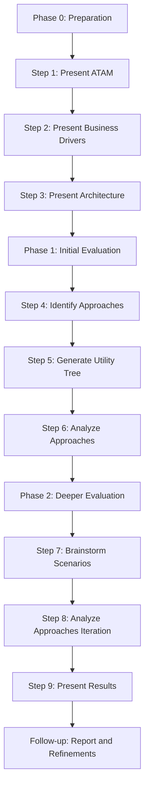

# EM - Question 04 - Describe the Architecture Tradeoff Analysis Method (ATAM) and outline its main steps

## The Architecture Tradeoff Analysis Method (ATAM)

ATAM is designed to assess software architectures early in the development lifecycle by systematically identifying tradeoffs among competing quality attributes, such as performance, security, modifiability, and reliability. This method brings together stakeholders—including architects, developers, managers, and end-users—to evaluate how architectural decisions impact business goals and requirements. By focusing on scenarios that represent real-world usage, ATAM uncovers risks, sensitivities (points where small changes significantly affect quality), and tradeoffs (where improving one attribute may degrade another).

ATAM evolved from earlier methods like the Software Architecture Analysis Method (SAAM) and is particularly valuable for large-scale systems where architectural flaws can be costly to fix later. It promotes a collaborative, scenario-driven approach rather than relying solely on quantitative metrics, ensuring that the architecture aligns with stakeholder priorities. The process typically spans two to three days and is facilitated by an external evaluation team to maintain objectivity. Benefits include improved decision-making, reduced project risks, and better documentation of architectural rationale, ultimately leading to more robust and adaptable systems.

#### Main Steps of ATAM
The ATAM process is structured into nine iterative steps, divided into phases: preparation, evaluation (often split into Phase 1 for initial analysis and Phase 2 for deeper exploration), and follow-up. These steps ensure a thorough examination of the architecture. Below is an outline of the main steps:

1. **Present the ATAM**: The evaluation leader introduces the method to all participants, explaining its purpose, process, and expected outcomes. This step sets expectations and ensures everyone understands their roles.

2. **Present Business Drivers**: Stakeholders, typically from the business or project management side, describe the system's goals, constraints, functional requirements, and key quality attributes. This establishes the context for evaluation.

3. **Present Architecture**: The lead architect presents the current architecture, including components, connectors, patterns, and rationale for design decisions. This provides a shared understanding of the system under review.

4. **Identify Architectural Approaches**: Participants catalog the key architectural tactics or patterns used to achieve quality attributes, such as redundancy for reliability or caching for performance.

5. **Generate Quality Attribute Utility Tree**: A hierarchical tree is built to prioritize quality attributes based on their utility (importance to the system). High-priority scenarios are refined into specific, measurable ones.

6. **Analyze Architectural Approaches**: The team maps scenarios from the utility tree to architectural elements, identifying risks, sensitivities, and tradeoffs. This step often reveals how decisions affect multiple attributes.

7. **Brainstorm and Prioritize Scenarios**: Additional scenarios are elicited from stakeholders through brainstorming, then voted on and prioritized to focus on the most critical ones.

8. **Analyze Architectural Approaches (Iteration)**: Similar to Step 6, but applied to the newly prioritized scenarios. This iterative analysis deepens insights into potential issues.

9. **Present Results**: The evaluation team summarizes findings, including identified risks, tradeoffs, and recommendations. A final report is prepared for stakeholders to guide architectural refinements.

To visualize the iterative nature of ATAM, consider the following flowchart in Markdown format using Mermaid syntax, which highlights the phased progression:

This diagram illustrates how ATAM builds from foundational presentations to in-depth analysis and resolution.

In summary, ATAM provides a rigorous yet practical framework for architecture evaluation, emphasizing collaboration and tradeoff awareness to foster high-quality software systems. Its application has been proven in various industries, from defense to commercial software, making it a cornerstone of modern software engineering practices.

