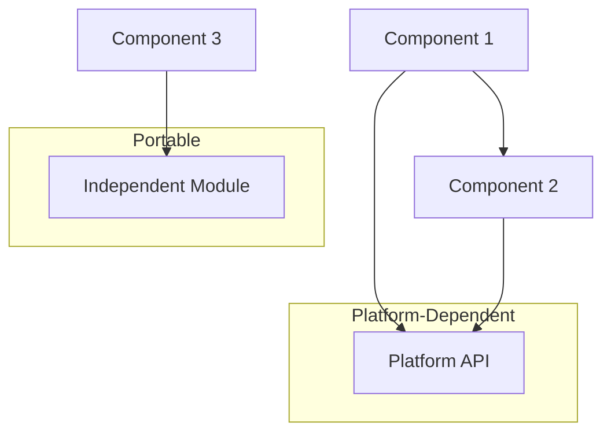

# EM - Question 07 - How would you apply mathematical modeling to evaluate the portability of a software architecture, including potential challenges?

### Applying Mathematical Modeling to Evaluate the Portability of a Software Architecture

Portability encompasses aspects such as platform independence, adaptability to new environments, and minimal dependency on specific resources. While mathematical modeling is more commonly used for operational attributes like performance and reliability (e.g., via queuing networks or Markov chains), it can be extended to portability through formal representations, metrics, and predictive analysis. This approach provides quantitative insights into architectural decisions, enabling architects to predict adaptation costs and identify risks early in the design phase. Below, I outline the application process, including methods, examples, and potential challenges.

#### Steps for Applying Mathematical Modeling to Portability Evaluation
Mathematical modeling transforms the software architecture into abstract representations (e.g., graphs, sets, or probabilistic models) to quantify portability. The process typically involves the following structured steps:

1. **Model the Architecture**: Represent the software architecture using formal notations, such as component-connector models or graph-based structures. For portability, focus on dependencies: nodes represent components or modules, and edges denote dependencies (e.g., platform-specific APIs, hardware interactions). Tools like Event-B can be used for set-theoretic modeling, defining static (e.g., carrier sets of environments) and dynamic (e.g., state transitions across platforms) elements.

2. **Define Portability Metrics and Properties**: Establish quantitative measures, such as a Portability Index (PI) calculated as PI = 1 - (number of platform-dependent components / total components), or dependency density using graph metrics like clustering coefficient (measuring how tightly coupled components are to platform-specific elements). Formal properties, such as invariance under environment changes, can be expressed mathematically (e.g., using predicates in Event-B: ∀ env1, env2 · (arch(env1) ⇒ arch(env2) with minimal Δchanges)).

3. **Apply Analytical Techniques**: Use mathematical methods to evaluate the model. For instance, graph theory can analyze modularity via community detection algorithms to predict adaptation effort (e.g., number of edges to refactor for a new platform). Probabilistic models, like Markov chains, can estimate the probability of successful porting based on historical failure rates of similar dependencies. Fuzzy logic can incorporate uncertainties, such as vague dependency impacts, by mapping metrics to fuzzy sets and inferring an overall portability score.

4. **Simulate and Verify**: Refine the model iteratively (e.g., through Event-B refinements) and verify properties using theorem proving or model checking. Tools like Rodin or ProB can discharge proof obligations to ensure the architecture maintains portability invariants across environments. Simulate porting scenarios to compute metrics like adaptation cost (e.g., expected lines of code changes).

5. **Interpret Results and Refine**: Compare modeled portability against thresholds (e.g., PI > 0.8 for high portability) and use insights to refactor the architecture, such as introducing abstraction layers to reduce dependencies.

#### Examples of Application
- **Embedded Systems Portability**: In developing operating systems for IoT devices, Event-B models separate generic OS functionality (e.g., context switching) from hardware specifics (e.g., register accesses on MSP430 vs. RISC-V). Refinements model portability as preserved invariants, with code generation tools like EB2LLVM producing verifiable, portable code. This was demonstrated in modeling a factorial function and OS kernel, quantifying portability through proof obligations.
  
- **Computer Algebra Software**: For systems like Mathematica or Axiom, mathematical modeling addresses algorithmic portability by representing algorithms as sets with defined semantics (e.g., branch cuts for complex functions). Graph models map dependencies (e.g., normalization factors), predicting porting effort via edge weights representing semantic differences.

- **General Software Architectures**: Using fuzzy logic on microservices, collect metrics like coupling to platform APIs, fuzzify them, and infer portability sub-scores (e.g., modifiability across clouds). Applied to projects like "Train Ticket," this yields a quantitative score for environment transfer ease.

To illustrate a simple dependency graph for portability evaluation, consider the following conceptual diagram in Markdown format using Mermaid syntax, where high clustering around platform nodes indicates low portability:

This graph shows dependency clustering; mathematical analysis (e.g., clustering coefficient ≈ 0.67) quantifies portability risks.

#### Potential Challenges
Applying mathematical modeling to portability evaluation, while powerful, presents several challenges:

1. **Data Availability and Accuracy**: Models require precise parameters (e.g., dependency reliabilities or semantic differences), which may be unavailable early in design, leading to approximations and reduced prediction accuracy. For portability, estimating adaptation costs across unknown future platforms is particularly difficult.

2. **Complexity and Scalability**: Large architectures can result in state space explosions during model checking, making verification computationally expensive. Handling uncertainties (e.g., varying mathematical definitions like branch cuts) requires advanced techniques like fuzzy logic, but defining rules demands expertise.

3. **Translation and Verification Issues**: Translating theory to models risks ambiguity or loss of intent, especially for portability in heterogeneous environments (e.g., hardware shifts). Verifying models across platforms is challenging due to evolving hardware, potentially introducing defects.

4. **Limited Scope and Tool Support**: Few models specifically target portability compared to performance; most focus on single attributes, and tool integration (e.g., for code generation) is immature, increasing manual effort.

5. **Sustainability and Reproducibility**: Models may not account for long-term changes (e.g., OS hardening), leading to "software collapse" and portability failures over time.

In summary, mathematical modeling offers a rigorous, quantitative way to evaluate software architecture portability by formalizing dependencies and predicting adaptations, but it must be balanced against challenges like complexity and data limitations. Combining it with other methods (e.g., scenario-based) can enhance comprehensiveness, ultimately leading to more resilient architectures.

