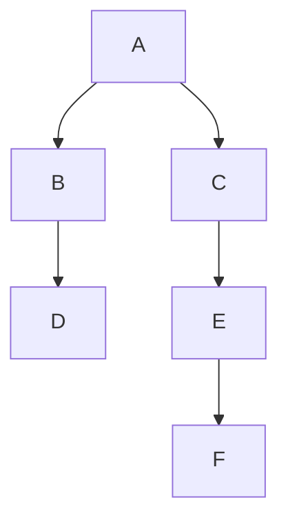

# EM - Question 08 Discuss the Propagation Cost metric in software architecture and provide an example of how it is calculated and interpreted.

## Discuss the Propagation Cost Metric in Software Architecture

Introduced by MacCormack, Rusnak, and Baldwin in their 2006 study on complex software designs, PC assesses the degree of coupling in an architecture, helping architects identify potential maintenance challenges and guide refactoring efforts. It is particularly valuable in large-scale systems where high coupling can lead to increased costs and risks during evolution. By focusing on both direct and indirect dependencies, PC provides insights into the system's resilience to change, complementing other metrics like coupling and cohesion.

PC is derived from the Design Structure Matrix (DSM) approach, which models system elements (e.g., files, modules, or components) and their dependencies. It extends beyond simple dependency counts by considering transitive effects, making it a robust indicator of architectural health in contexts like open-source projects or enterprise applications.

#### Definition and Purpose
The Propagation Cost metric quantifies the average fraction of the system's elements that could be affected by a change to a randomly selected element, accounting for both direct dependencies (immediate connections) and indirect dependencies (chains of effects). Formally, it represents the density of the visibility matrix, which captures the potential impact of changes propagating through the architecture. 

The purpose of PC is to measure modularity: a low PC indicates a loosely coupled system where changes are localized, reducing maintenance efforts and enabling easier evolution. Conversely, a high PC signals tight coupling, where modifications can ripple widely, increasing technical debt and development costs. It is often used in empirical studies to compare architectures, such as proprietary versus open-source code, or to evaluate redesign impacts.

#### Calculation Method
To calculate PC, follow these steps:

1. **Construct the Dependency Matrix (M)**: Create an N x N binary matrix where N is the number of elements (e.g., source files). Set M[i,j] = 1 if element i depends on element j; otherwise, 0.

2. **Compute Higher-Order Dependencies**: Raise M to successive powers (M^2 = M * M, M^3 = M^2 * M, etc.) to capture indirect dependencies. Convert non-zero entries to 1 for binary representation.

3. **Form the Visibility Matrix (V)**: Sum the matrices from n=0 (identity matrix, where changes affect the element itself) to the maximum path length (typically N-1): V = I + M + M^2 + ... + M^{N-1}.

4. **Calculate Propagation Cost**: PC = (sum of all entries in V) / N^2, expressed as a percentage. This is equivalent to the average Fan-In Visibility or Fan-Out Visibility.

The formula is:
\[
PC = \frac{\sum_{i=1}^{N} \sum_{j=1}^{N} V[i,j]}{N^2}
\]
where V[i,j] indicates if a change to j affects i (or vice versa, due to symmetry in interpretation).

Tools like Lattix or DSM analyzers automate this process for large systems.

#### Example of Calculation
Consider a simple system with six elements: A, B, C, D, E, F, and dependencies: A depends on B and C; B on D; C on E; E on F. 

The dependency matrix M is:

|   | A | B | C | D | E | F |
|---|----|----|----|----|----|----|
| A | 0 | 1 | 1 | 0 | 0 | 0 |
| B | 0 | 0 | 0 | 1 | 0 | 0 |
| C | 0 | 0 | 0 | 0 | 1 | 0 |
| D | 0 | 0 | 0 | 0 | 0 | 0 |
| E | 0 | 0 | 0 | 0 | 0 | 1 |
| F | 0 | 0 | 0 | 0 | 0 | 0 |

After computing powers and summing to V (binary), the visibility matrix shows all reachable dependencies. The row sums (Fan-Out Visibility) are: A=6, B=2, C=3, D=1, E=2, F=1. Total sum = 15.

Thus, PC = 15 / (6 * 6) ≈ 0.417 or 41.7%.

For visualization, the dependency graph can be represented as:

This illustrates the chain where a change to F affects E, C, and A indirectly.

#### Interpretation
A PC of 41.7% in the example means that, on average, a change to any element could impact about 42% of the system, indicating moderate coupling—changes to peripheral elements like D have low impact (1/6 ≈ 17%), but core ones like A affect many (6/6 = 100%). Lower values (e.g., <10%) suggest high modularity, as seen in Linux (5.16%) versus initial Mozilla (17.35%), where redesign reduced PC to 2.78%, improving maintainability. High PC (e.g., 23% in a BioPharma portfolio) highlights risks in core components, correlating with higher change costs. 

In practice, architects aim to minimize PC through patterns like layering or microservices, monitoring it over time to prevent architectural decay. While powerful, PC focuses on structure and may need augmentation for semantic aspects.

In summary, the Propagation Cost metric offers a quantitative lens on change impact, enabling informed decisions to enhance software evolvability and reduce long-term costs.
