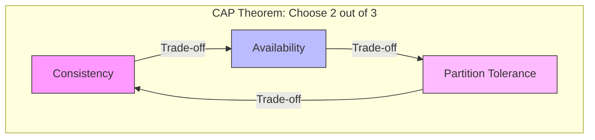
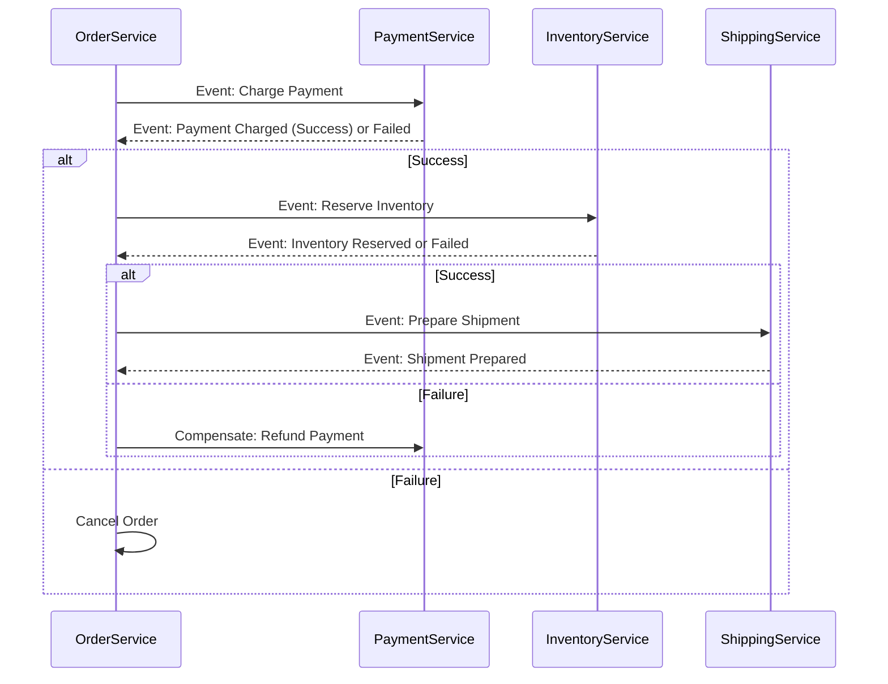
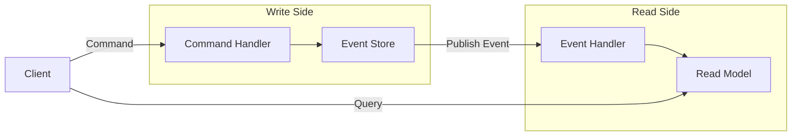

# MA - Question 03 - How do you ensure data consistency in a distributed system, especially with microservices?

### Ensuring Data Consistency in Distributed Systems with Microservices

In modern software architectures, particularly those employing microservices, ensuring data consistency across distributed components is a critical challenge. Microservices promote decentralization, where each service often maintains its own database to achieve autonomy and scalability, but this polyglot persistence can lead to inconsistencies during cross-service operations.  The CAP Theorem fundamentally influences these designs, stating that in a distributed system, you can only guarantee two out of three properties: Consistency (every read receives the most recent write), Availability (every request receives a response), and Partition Tolerance (the system continues to operate despite network partitions).  In practice, most modern systems prioritize Availability and Partition Tolerance (AP), opting for Eventual Consistency over Strong Consistency to handle scale and failures.

To visualize the CAP Theorem trade-offs in distributed systems:

This diagram illustrates the impossible triangle: For microservices in cloud environments (e.g., AWS or Azure), network partitions are inevitable, so designs often sacrifice immediate Consistency for better Availability.

Data consistency in such systems can be categorized into Strong Consistency (immediate synchronization, e.g., via distributed locks) and Eventual Consistency (data converges over time, suitable for high-availability scenarios like e-commerce or social media).  Below, I outline key strategies to ensure consistency, focusing on modern practices like asynchronous communication, event-driven architectures, and patterns that avoid blocking operations.

#### 1. Eventual Consistency with Asynchronous Messaging
In microservices, Eventual Consistency is achieved by propagating changes asynchronously via message brokers (e.g., Kafka, RabbitMQ). Services publish events upon updates, and subscribers react accordingly, ensuring data synchronizes over time without tight coupling. 

**Practical Application**: In an e-commerce system, when an Order Service updates an order status, it publishes an "OrderUpdated" event. The Inventory Service subscribes and adjusts stock levels eventually. This tolerates temporary inconsistencies (e.g., overselling during peaks) but resolves them via reconciliation jobs.

**Pros and Cons**: Enhances scalability and fault tolerance but requires idempotent operations to handle duplicate messages and monitoring for convergence delays.

#### 2. Saga Pattern for Distributed Transactions
The Saga Pattern is a modern alternative to traditional distributed transactions, breaking a long-running transaction into a sequence of local transactions coordinated by events or orchestration.  It maintains consistency without global locks, using compensating transactions for rollbacks.

- **Choreography Saga**: Services react to events autonomously (decentralized).
- **Orchestration Saga**: A central coordinator (e.g., via AWS Step Functions) manages the flow.

To illustrate a Choreography Saga for an order processing workflow:

This diagram shows how each service commits locally and triggers the next, with compensations (e.g., refunds) for failures, ensuring eventual consistency. 

**Example in Practice**: In a banking app, transferring funds between accounts involves a Saga: Debit one account (local commit), then credit the other; if credit fails, compensate by reversing the debit.

**Comparison to Two-Phase Commit (2PC)**: Unlike 2PC, which uses a coordinator for prepare/commit phases and can block resources during failures, Sagas are non-blocking and more resilient in microservices.  2PC suits short-lived transactions but scales poorly; Sagas are preferred in modern, cloud-native setups.

#### 3. Event Sourcing and CQRS
Event Sourcing persists state as a sequence of immutable events, allowing reconstruction of current state by replaying them, ensuring auditability and consistency. Combined with Command Query Responsibility Segregation (CQRS), it separates write (commands) from read (queries) models, enabling optimized consistency for reads via materialized views.

**Practical Application**: In a social media platform, user actions (e.g., posts) are stored as events in an event store (e.g., EventStoreDB). Read services subscribe to build denormalized views for queries, achieving eventual consistency.

A simple Mermaid diagram for CQRS flow:

This separates concerns, allowing scalable reads without locking writes.

#### 4. Transactional Outbox Pattern
To avoid dual writes (database + message queue) failures, the Transactional Outbox stores events/outbox messages in the same database transaction as business data, then polls and publishes them reliably. 

**Example**: In a microservice using Debezium for CDC (Change Data Capture), changes are captured from the outbox table and streamed to Kafka, ensuring no lost updates.

#### Additional Best Practices
- **Idempotency and Reconciliation**: Use unique keys for operations to handle retries; run periodic jobs to detect and fix inconsistencies.
- **Versioning and Optimistic Locking**: Append versions to data to prevent concurrent update conflicts.
- **Monitoring and Observability**: Tools like Prometheus or ELK Stack track consistency metrics.

In interview contexts, emphasize trade-offs: For financial systems needing strong consistency, use 2PC sparingly; for scalable apps, lean on Sagas and Eventual Consistency. Always align with business requirements, as over-engineering consistency can hinder performance. These approaches are staples in modern architectures like those on Kubernetes or serverless platforms, promoting resilience and horizontal scaling.