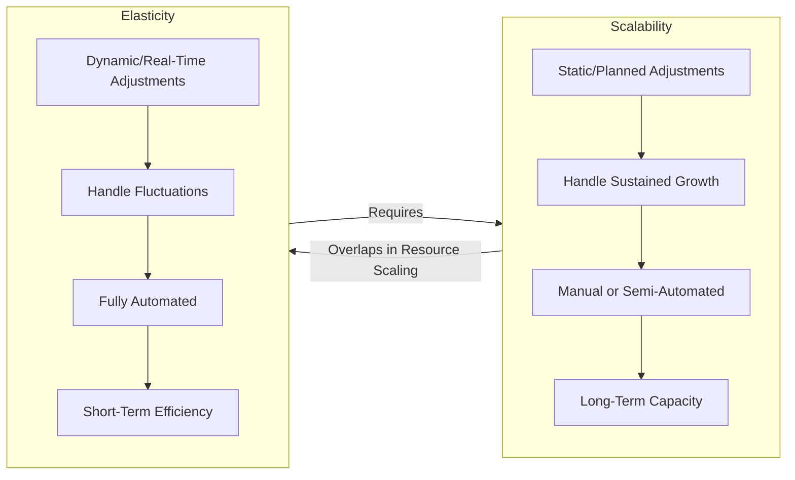
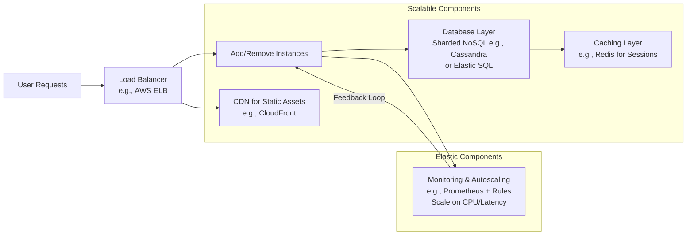

# MA - Question 05 - What's the difference between scalability and elasticity? How would you design a system to be both?

## Understanding Scalability and Elasticity in Distributed Systems

In the context of modern distributed systems and cloud computing, scalability and elasticity are foundational concepts that address how systems handle varying workloads, resource demands, and growth. These terms are often interrelated but distinct, with scalability focusing on the inherent capacity to accommodate change, and elasticity emphasizing the dynamic, automated nature of that accommodation. Below, I provide a comprehensive explanation suitable for a graduate-level course in software architecture or distributed systems, drawing on established definitions and principles from reliable sources such as AWS, Azure, Google Cloud, and peer-reviewed technical literature. I'll include Mermaid diagrams to illustrate key concepts visually.

#### Definition of Scalability
Scalability refers to a system's ability to handle an increasing or decreasing workload by adjusting its resources, such as adding more processing power, storage, or nodes, without requiring a complete redesign. It measures how well the system can grow (or shrink) to meet demand while maintaining performance, efficiency, and cost-effectiveness. Scalability can be achieved through two primary mechanisms:
- **Vertical Scalability (Scaling Up/Down)**: This involves enhancing the capabilities of existing resources, such as increasing CPU, RAM, or storage on a single machine or database instance. It is simpler to implement but has limits, as it relies on the maximum capacity of a single node and may involve downtime during upgrades.
- **Horizontal Scalability (Scaling Out/In)**: This entails adding or removing multiple instances or nodes (e.g., servers or database shards) to distribute the load. It supports near-limitless growth by leveraging commodity hardware and is ideal for distributed systems, though it introduces complexity in data consistency and coordination.

For instance, in database systems, NoSQL databases like Cassandra are designed for horizontal scalability to handle petabyte-scale data, whereas traditional relational databases may favor vertical approaches until hitting hardware ceilings. Scalability is often evaluated using metrics like throughput (requests per second) and response time under load, with theoretical models such as Amdahl's Law highlighting bottlenecks in parallelizable vs. serial components of a system.

#### Definition of Elasticity
Elasticity builds on scalability by introducing automation and dynamism: it is the ability of a system to automatically provision and de-provision resources in response to real-time demand fluctuations, ensuring optimal resource utilization without manual intervention. In cloud environments, this means scaling resources "out and in" (horizontal) or "up and down" (vertical) based on metrics like CPU utilization, request latency, or traffic volume, often within minutes or seconds. Elasticity is a hallmark of cloud-native architectures, enabling cost savings by releasing idle resources and maintaining performance during spikes, such as seasonal e-commerce traffic.

From a theoretical perspective, elasticity aligns with control theory in systems engineering, where feedback loops (e.g., monitoring metrics and triggering auto-scaling rules) maintain homeostasis. For example, AWS Auto Scaling or Azure Virtual Machine Scale Sets use thresholds to add/remove instances automatically. Unlike static scalability, elasticity handles unpredictable, dynamic changes, making it essential for systems with variable workloads like streaming services (e.g., Netflix during peak hours).

#### Key Differences Between Scalability and Elasticity
While scalability and elasticity are complementary, they differ in scope, automation, and application:
- **Scope and Focus**: Scalability is about the system's capacity to handle sustained growth or reduction in workload through resource adjustments, often planned and manual (e.g., provisioning more servers for expected user growth). Elasticity focuses on short-term, dynamic adaptations to fluctuating demand, emphasizing automatic expansion and contraction to match real-time needs.
- **Automation Level**: Scalability does not inherently require automation; a system can be scalable if it can be manually upgraded to handle more load. Elasticity, however, mandates automation for rapid response, making it a subset or extension of scalability in cloud contexts.
- **Time Horizon and Use Cases**: Scalability addresses long-term strategic growth (e.g., scaling a database for a growing user base), while elasticity handles tactical, short-term variations (e.g., auto-scaling during a flash sale). A scalable system might not be elastic if it requires human intervention, but an elastic system is inherently scalable.
- **Trade-offs**: Scalability may involve upfront costs and design complexity (e.g., ensuring stateless components for horizontal scaling), while elasticity adds operational overhead like monitoring and potential over-provisioning if thresholds are misconfigured. In distributed systems, elasticity can introduce challenges like eventual consistency under the CAP theorem, where rapid scaling might trade consistency for availability.

Scalability optimizes for total cost of ownership over time, while elasticity minimizes waste through pay-as-you-go pricing.

To illustrate the differences:

#### Designing a System to Be Both Scalable and Elastic
To design a distributed system that is both scalable (capable of handling growth) and elastic (automatically adapting to demand), architects must integrate principles from cloud-native design, microservices, and DevOps. This involves a holistic approach: selecting appropriate technologies, implementing automation, and ensuring resilience. Below, I outline key design strategies, grounded in established frameworks from Google Cloud, AWS, and industry patterns.

1. **Adopt Modular, Loosely Coupled Architectures**: Break the system into independent microservices or serverless functions, allowing each component to scale independently. This avoids monolithic bottlenecks and enables horizontal scaling. For example, use Kubernetes (e.g., Google Kubernetes Engine) for orchestrating containers, where services communicate via APIs or message queues like Kafka for asynchronous decoupling. Trade-off: Increased complexity in service discovery (e.g., using Consul or Istio).

2. **Implement Horizontal Scaling with Load Balancing**: Favor scaling out by distributing traffic across multiple instances using load balancers (e.g., AWS Elastic Load Balancing or Google Cloud Load Balancing). This ensures fault tolerance and elasticity via auto-scaling groups that add/remove nodes based on metrics. For databases, employ sharding or replication in systems like MongoDB or Cloud Spanner to distribute data.

3. **Leverage Managed Services and Serverless Computing**: Use cloud-managed services like AWS Lambda, Azure Functions, or Google Cloud Run, which inherently provide elasticity by auto-scaling based on invocations. This reduces infrastructure management and supports scalability without provisioning servers. Example: A web app backend can use serverless for API endpoints, scaling to zero during low traffic.

4. **Incorporate Autoscaling and Monitoring**: Configure auto-scaling rules based on key performance indicators (KPIs) like CPU > 70% or latency > 200ms. Tools like Prometheus for monitoring and alerting enable data-driven decisions. Elasticity is achieved through feedback loops that provision resources automatically. Minimize startup times with pre-baked images or containers for rapid scaling.

5. **Ensure Data Management for Scalability**: Choose databases that support elasticity, such as NoSQL for horizontal partitioning or elastic SQL options like Azure SQL Hyperscale. Implement caching (e.g., Redis) to offload databases and content delivery networks (CDNs) like CloudFront for global scalability.

6. **Build Resilience and Fault Tolerance**: Use patterns like circuit breakers (e.g., Hystrix) and retries to handle failures during scaling. Align with CAP theorem by opting for eventual consistency in elastic setups. Test with chaos engineering (e.g., Netflix's Chaos Monkey) to validate elasticity under partitions.

Consider a real-world example like Netflix's architecture: Microservices on AWS with auto-scaling, Cassandra for scalable storage, and Zuul for load balancing, achieving both properties to handle millions of concurrent streams.

To illustrate a high-level architecture for a scalable and elastic e-commerce system:

This design ensures the system can scale horizontally for growth while elastically adjusting to demand spikes, balancing performance, cost, and reliability.