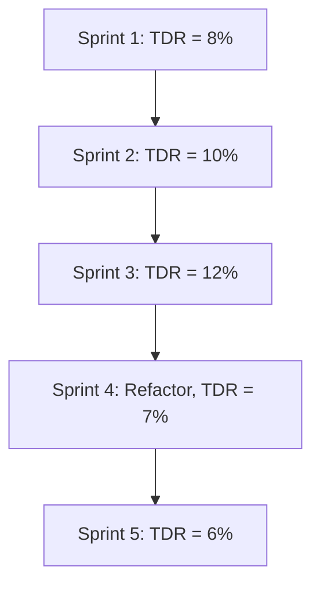

# TD - Question 02 - How do you identify, measure, and track technical debt in a project or system?

### Identifying, Measuring, and Tracking Technical Debt in a Project or System

Technical debt, a metaphor coined by Ward Cunningham, refers to the implied cost of future rework caused by choosing expedient but suboptimal design or implementation solutions in software development. It encompasses issues in code, architecture, design, documentation, or testing that compromise long-term maintainability, scalability, or quality, often accruing "interest" in the form of increased maintenance costs or reduced agility. Managing technical debt is critical for ensuring sustainable software development, particularly in large-scale systems where unchecked debt can lead to significant operational and financial risks. Below, I outline a structured approach to identify, measure, and track technical debt, supported by established methods and tools from software engineering literature.

#### Identifying Technical Debt
Identification involves recognizing sources of technical debt across various dimensions of a software system, including code, architecture, and processes. Technical debt can be intentional (e.g., shortcuts to meet deadlines) or unintentional (e.g., emergent issues from lack of expertise) and may stem from code smells, architectural erosion, or inadequate testing. The following steps are commonly used:

1. **Static Code Analysis**: Use tools like SonarQube, CodeClimate, or CAST to detect code-level issues such as code smells (e.g., duplicated code, overly complex methods), violations of coding standards, or outdated dependencies. These tools flag potential debt by analyzing metrics like cyclomatic complexity or technical debt ratio.

2. **Architecture and Design Review**: Conduct scenario-based evaluations (e.g., using ATAM or SAAM) to identify architectural debt, such as tight coupling, lack of modularity, or violations of design principles like SOLID. For instance, an architecture overly reliant on a specific vendor’s technology may indicate portability debt.

3. **Stakeholder Feedback and Documentation Review**: Engage developers, testers, and maintainers to identify undocumented or poorly understood components, which often signal documentation debt. Review requirements traceability to uncover gaps in testing or requirements drift.

4. **Process and Team Analysis**: Assess development practices, such as skipping code reviews or inadequate test coverage, which contribute to process debt. Retrospectives and agile practices like sprint reviews help surface these issues.

5. **Dependency and Technology Scans**: Use tools like Dependabot or OWASP Dependency-Check to identify outdated libraries or frameworks, which contribute to technical debt by increasing security risks or maintenance costs.

#### Measuring Technical Debt
Measurement quantifies the extent and impact of technical debt to prioritize remediation efforts. It often involves a combination of quantitative metrics and qualitative assessments, as technical debt encompasses both tangible (e.g., code issues) and intangible (e.g., knowledge loss) elements. Common approaches include:

1. **Technical Debt Ratio (TDR)**: TDR, often calculated by tools like SonarQube, estimates the cost to fix issues relative to the cost of developing the codebase. It is expressed as:
   \[
   TDR = \frac{\text{Estimated Remediation Cost}}{\text{Estimated Development Cost}}
   \]
   Remediation cost is derived from effort estimates (e.g., hours to fix code smells), while development cost is based on lines of code or function points. A TDR of 5% suggests that fixing debt requires 5% of the effort of rewriting the system.

2. **Code Metrics**: Metrics like cyclomatic complexity, code churn (frequency of changes), and maintainability index provide insights into code-level debt. For example, a high cyclomatic complexity (>10 per method) indicates potential maintenance challenges.

3. **Propagation Cost (PC)**: As discussed previously, PC measures change impact through dependency analysis using a Design Structure Matrix (DSM). A high PC (e.g., >20%) indicates architectural debt due to tight coupling, increasing the cost of modifications.

4. **Debt Interest Estimation**: Quantify the "interest" of technical debt by estimating additional effort or defects caused by existing issues. For example, Martin Fowler’s Technical Debt Quadrant distinguishes reckless versus prudent debt, with tools like CAST estimating interest as increased defect rates or maintenance time.

5. **Qualitative Assessment**: For non-code debt (e.g., documentation or process debt), use frameworks like SQALE (Software Quality Assessment based on Lifecycle Expectations) to categorize debt items and estimate remediation effort based on stakeholder input.

#### Tracking Technical Debt
Tracking involves continuously monitoring technical debt to ensure it remains manageable and aligns with project priorities. This requires integrating debt management into development workflows and using tools to maintain visibility. Key practices include:

1. **Technical Debt Backlog**: Integrate debt items into the project backlog (e.g., in Jira or Azure DevOps) as user stories or tasks, prioritized alongside features based on impact and cost. For example, a task to refactor a tightly coupled module might be prioritized if it delays new feature development.

2. **Continuous Monitoring with Tools**: Use static analysis tools (e.g., SonarQube, CAST) integrated into CI/CD pipelines to track metrics like TDR or code smells over time. Dashboards visualize trends, alerting teams to debt accumulation.

3. **Periodic Architecture Reviews**: Schedule regular architecture evaluations (e.g., quarterly) using methods like ATAM to reassess architectural debt, particularly for evolving systems where new requirements may introduce debt.

4. **Metrics Tracking with Visualization**: Use tools like Grafana or Power BI to plot metrics like PC or TDR over releases, helping stakeholders understand debt trends. For example, a rising PC trend might prompt an architectural refactoring sprint.

5. **Governance and Policies**: Establish policies for managing debt, such as allocating 10-20% of sprint capacity to debt repayment or setting thresholds (e.g., TDR < 10%) to trigger action. Governance ensures debt is addressed proactively rather than reactively.

To illustrate the tracking process, consider the following conceptual chart in Markdown format using Mermaid syntax, showing how technical debt (measured as TDR) might evolve over sprints:

This chart shows debt accumulation followed by a refactoring effort reducing TDR, highlighting the impact of proactive management.

#### Example Application
Consider a microservices-based e-commerce platform where static analysis reveals duplicated code in payment processing services (code debt) and tight coupling to a specific cloud provider’s database (architectural debt). Using SonarQube, the TDR is calculated as 7%, with an estimated 200 hours to remediate 50 code smells. A DSM analysis yields a PC of 25%, indicating high change impact due to database dependencies. The team tracks these metrics in Jira, prioritizing refactoring tasks in the next sprint, and uses CI/CD integration to monitor TDR trends, reducing it to 5% after introducing an abstraction layer for database access.

#### Challenges
- **Quantifying Intangible Debt**: Non-code debt (e.g., documentation or knowledge debt) is hard to measure objectively, requiring qualitative assessments that may lack precision.
- **Balancing Debt and Features**: Prioritizing debt repayment over new features can face resistance from stakeholders focused on short-term deliverables.
- **Tool Limitations**: Tools may not capture all debt types (e.g., architectural erosion) or provide consistent metrics across projects, necessitating manual validation.
- **Context Dependency**: Debt impact varies by project; a high TDR in a stable system may be less critical than in a rapidly evolving one.

In summary, identifying, measuring, and tracking technical debt involves a combination of static analysis, architectural reviews, and continuous monitoring, supported by quantitative metrics like TDR and PC and qualitative stakeholder input. By embedding debt management into development processes, teams can mitigate risks, enhance maintainability, and ensure long-term system health.