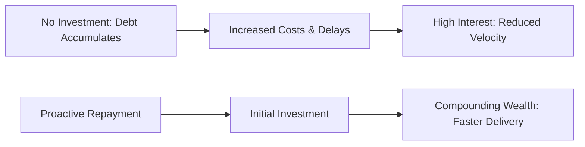

# TD - Question 07 - How do you convince non-technical stakeholders (e.g. product management, business leadership) to allocate time and budget toward paying down technical debt, given pressure to deliver new features?

## Convincing Non-Technical Stakeholders to Allocate Resources for Technical Debt Repayment

Technical debt represents the accumulated costs of future rework from expedient development choices, and addressing it requires framing the discussion in business terms to demonstrate its impact on organizational goals like revenue, efficiency, and competitiveness. This is crucial because non-technical stakeholders often focus on short-term deliverables, viewing debt repayment as a distraction rather than an investment. Drawing from established practices and real-world insights, the key is to use empathy, data, and relatable narratives to bridge the gap between technical realities and business priorities. Below, I outline proven strategies, supported by examples and quantification methods, followed by potential challenges and a visual aid.

#### Key Strategies
1. **Reframe Technical Debt as an Opportunity for Technical Wealth**: Shift the conversation from "debt" (a negative connotation implying past mistakes) to "building technical wealth" (a positive framing emphasizing future gains). Explain that investing in debt repayment creates compounding productivity, similar to how upgrading a home's infrastructure saves money long-term. This approach makes stakeholders more receptive, as it aligns with growth-oriented mindsets. For instance, highlight how resolving debt can double team productivity, allowing the same team to deliver more features without additional hires.

2. **Use Relatable Analogies to Simplify Concepts**: Avoid technical jargon by employing everyday analogies that resonate with non-technical audiences. Common examples include:
   - Comparing technical debt to deferred home maintenance: Ignoring small issues like a leaky roof leads to catastrophic damage, just as unaddressed debt causes system failures or slowed development.
   - Likening it to financial debt or credit card interest: Small borrowings accrue high costs over time, diverting resources from innovation.
   - Referencing "The Phoenix Project" to describe unplanned work (e.g., bug fixes) as a "silent killer" that erodes delivery capacity.
   These analogies help stakeholders visualize the urgency without needing deep technical knowledge.

3. **Quantify the Impact and Demonstrate ROI**: Provide concrete data to show how technical debt affects business metrics, such as revenue loss, increased costs, or delayed launches. Use tools like SonarQube or CodeScene to measure debt through indicators like lead time for features, throughput (planned vs. unplanned work), or maintenance costs (which can consume 70% of IT budgets). For example:
   - Calculate hours lost per sprint (e.g., 8 hours on manual workarounds) or feature delivery delays (e.g., from 2 weeks to 12 weeks).
   - Estimate ROI: Show that investing in debt repayment can reduce unplanned work by 50%, freeing resources for new features and potentially saving 20-30% in long-term costs.
   Preempt the "so what?" question by linking to business outcomes, like reduced churn from faster feature releases.

4. **Visualize Data and Progress**: Create simple charts or graphs to illustrate trends, making abstract concepts tangible. For instance, use lead time variability graphs to show how debt causes unpredictable delivery, or throughput charts to demonstrate the ratio of unplanned (debt-related) vs. planned work. Share before-and-after visuals from refactoring efforts to prove measurable improvements, such as increased developer velocity or reduced bug rates.

5. **Highlight Risks and Business Consequences**: Emphasize the dangers of inaction, including security vulnerabilities, system outages, compliance issues, or competitive disadvantages. Reference real-world examples like Netscape's downfall due to unmanageable debt, or internal cases where debt led to delayed projects and lost revenue. Tie this to stakeholder priorities, such as customer satisfaction (e.g., slower load times from 0.75 to 4 seconds increasing bounce rates).

6. **Build Empathy and Foster Collaboration**: Understand stakeholders' perspectives by asking about their goals and success metrics. Involve them in discussions outside formal meetings (e.g., informal lunches) to explain issues in their language. Maintain a technical debt register—a shared document listing debt items with business impacts, reasons, and estimated fixes—to set expectations and uncover risks collaboratively.

7. **Propose Phased Plans and Multiple Options**: Offer flexible solutions, such as incremental refactoring (e.g., addressing one module per sprint) or stop-gap fixes, with costed alternatives to reduce perceived risk. Dedicate a portion of capacity (e.g., 10-20% per sprint) to debt repayment, integrating it into roadmaps to balance with new features.

#### Examples of Application
In one case, a team used lead time and throughput graphs to show how technical debt doubled unplanned work, convincing management to invest; post-refactoring, delivery capacity increased without new hires. Another example involved reframing debt for a client, leading to automated testing that halved feature delivery time and boosted productivity.

#### Challenges
Stakeholders may resist due to short-term focus or lack of understanding, so pick battles wisely to avoid burnout. Ensuring accurate quantification can be difficult without tools, and cultural divides may persist if empathy is lacking.

To illustrate the compounding effects of technical debt versus proactive investment, consider the following conceptual graph in Markdown format using Mermaid syntax:

This graph contrasts the escalating costs of inaction with the long-term benefits of repayment.

In summary, convincing non-technical stakeholders requires translating technical debt into business value through analogies, data, and collaborative plans, ultimately demonstrating that repayment enhances rather than hinders feature delivery and organizational success.