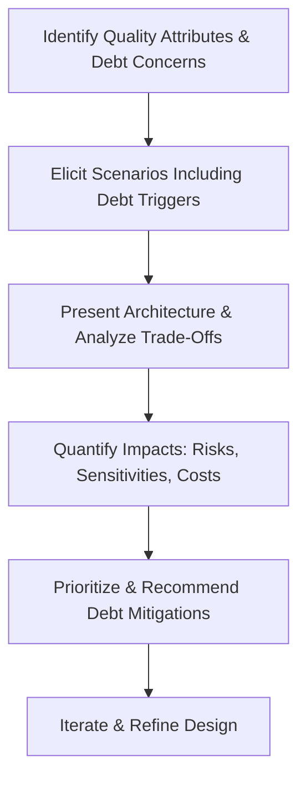

# TD - Question 08 - What architectural trade-off analysis methods do you know (for example ATAM), and how would you apply them in evaluating a system design or architecture decision where technical debt is a concern?

## Architectural Trade-Off Analysis Methods and Their Application to Technical Debt Concerns

Architectural trade-off analysis methods are systematic approaches to assess software architectures by identifying and balancing competing quality attributes, such as performance, modifiability, security, and cost, while uncovering risks and sensitivities. These methods are particularly useful in complex systems where decisions can accumulate technical debt—the implied cost of future rework due to suboptimal choices that prioritize short-term gains over long-term maintainability. By explicitly addressing trade-offs, these methods help mitigate technical debt by promoting informed decisions that align with business goals and reduce long-term costs. Below, I outline key methods I am familiar with, based on established software engineering practices, followed by their application in scenarios involving technical debt.

#### Known Architectural Trade-Off Analysis Methods
Several methods have been developed, primarily by the Software Engineering Institute (SEI) and others, to evaluate architectures. These include scenario-based approaches that use hypothetical situations to probe quality attributes and reveal trade-offs. Here are some prominent ones:

1. **Architecture Tradeoff Analysis Method (ATAM)**: ATAM is a comprehensive, scenario-driven method for evaluating software architectures against multiple quality attributes, such as performance, availability, security, and modifiability. It involves stakeholders in identifying risks, sensitivities (where small changes significantly impact attributes), and trade-offs (e.g., improving security might degrade performance). The process includes presenting business drivers, architecture, and scenarios, followed by analysis to produce outputs like prioritized risks and tradeoff points.

2. **Scenario-Based Architecture Analysis Method (SAAM)**: SAAM, a precursor to ATAM, focuses on evaluating architectures for specific quality attributes, particularly modifiability, using scenarios to assess change impacts. It classifies scenarios as direct (supported without changes) or indirect (requiring modifications), helping compare alternative designs by estimating adaptation efforts.

3. **Cost Benefit Analysis Method (CBAM)**: CBAM extends ATAM by incorporating economic considerations, quantifying the costs and benefits of architectural decisions to evaluate return on investment (ROI). It prioritizes scenarios based on utility and analyzes trade-offs in terms of financial impact, making it suitable for resource-constrained environments.

4. **Architecture-Level Modifiability Analysis (ALMA)**: ALMA specializes in assessing modifiability by predicting maintenance costs and risks through scenario-based impact analysis. It uses models like UML to estimate change propagation, focusing on long-term evolvability.

Other methods, such as Performance Assessment of Software Architectures (PASA) for performance-specific trade-offs or lightweight techniques like expert reviews, can complement these but are less formal in addressing broad trade-offs.

#### Applying These Methods to Evaluate System Design or Architecture Decisions with Technical Debt Concerns
When technical debt is a concern—such as in legacy systems with accumulated suboptimal designs or during rapid iterations where shortcuts are taken—these methods can be adapted to identify, quantify, and mitigate debt by evaluating trade-offs between immediate benefits and future costs. Technical debt often manifests as architectural erosion, where decisions increase maintenance "interest" over time. The application involves integrating debt-specific scenarios and metrics into the evaluation process. Below, I describe how to apply key methods, with examples.

1. **Applying ATAM**: ATAM is highly effective for technical debt as it explicitly uncovers trade-offs that contribute to debt, such as choosing a monolithic design for speed but incurring modifiability debt. In evaluation:
   - **Step 1**: Present business drivers, including debt concerns like budget for refactoring.
   - **Step 2**: Build a quality attribute utility tree, prioritizing attributes like maintainability and including debt-related scenarios (e.g., "Migrate to cloud without rewriting 50% of code").
   - **Step 3**: Analyze architectural approaches for sensitivities (e.g., dependency on outdated libraries) and trade-offs (e.g., short-term performance gain vs. long-term debt accumulation).
   - **Step 4**: Identify risks, such as high propagation cost from tight coupling, and recommend mitigations like modularization.
   
   **Example**: In a ground-based command system, ATAM revealed trade-offs between reliability and modifiability, highlighting technical debt in inflexible components that would require costly rework for future upgrades. This led to prioritizing debt repayment in the roadmap.

2. **Applying SAAM**: SAAM can evaluate debt by focusing on modifiability scenarios that simulate changes, estimating the effort (and thus debt) required for adaptations. 
   - **Step 1**: Elicit scenarios representing potential debt triggers, like "Update a third-party API integration."
   - **Step 2**: Classify as indirect if changes propagate widely, measuring debt via impact analysis (e.g., number of affected modules).
   - **Step 3**: Prioritize and reveal interactions to quantify debt hotspots.
   
   **Example**: For a system with legacy code, SAAM might show that a design decision favoring quick implementation incurs high debt for scalability changes, guiding a refactor to reduce future interest.

3. **Applying CBAM**: CBAM is ideal when technical debt involves economic trade-offs, as it quantifies ROI for debt repayment.
   - **Step 1**: Integrate with ATAM outputs, assigning costs (e.g., developer hours) and benefits (e.g., reduced maintenance time) to scenarios.
   - **Step 2**: Calculate utility and prioritize decisions that minimize debt accumulation while maximizing value.
   - **Step 3**: Evaluate alternatives, such as incurring short-term debt for faster delivery versus investing upfront to avoid it.
   
   **Example**: In a complex system, CBAM could compare the cost of refactoring a debt-laden module (high upfront cost, low future debt) against patching it (low upfront, high interest), favoring the former if ROI justifies it.

4. **Applying ALMA**: ALMA targets modifiability debt by predicting maintenance costs.
   - **Step 1**: Model the architecture and simulate change scenarios.
   - **Step 2**: Estimate debt through metrics like change effort or risk probability.
   - **Step 3**: Recommend designs that minimize predicted debt.
   
   **Example**: For software with evolving requirements, ALMA might quantify debt from poor modularity, leading to targeted improvements.

To visualize the application process when technical debt is involved, consider the following flowchart in Markdown format using Mermaid syntax, adapting a general trade-off analysis to include debt evaluation:

This diagram shows an iterative cycle that integrates debt assessment into trade-off analysis.

#### Challenges and Best Practices
Challenges include stakeholder alignment on debt priorities and quantifying intangible debt. Best practices: Combine methods (e.g., ATAM with CBAM for economic depth), use tools like SonarQube for metrics, and conduct evaluations periodically to track debt evolution.

In summary, methods like ATAM, SAAM, CBAM, and ALMA provide structured ways to analyze trade-offs, and when applied to technical debt concerns, they enable proactive evaluation of system designs, reducing long-term risks and fostering sustainable architectures.
