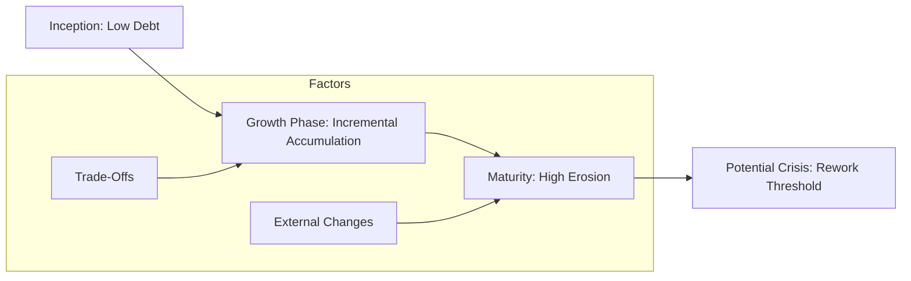

# TD - Question 09 - What is architectural debt (as opposed to code debt)? How does it evolve over time, and what are strategies and costs involved in paying it down?

### Architectural Debt (as Opposed to Code Debt)

Architectural debt, often referred to as architectural technical debt (ATD), is a subset of the broader concept of technical debt, which encompasses the future rework costs arising from expedient development choices. These concepts are critical in software engineering, as unmanaged debt can hinder system maintainability, scalability, and innovation. Drawing from established literature and practices, I will provide a structured overview supported by insights from reliable sources.

#### Definition and Distinction from Code Debt
Architectural debt refers to flaws or suboptimal decisions in the high-level structure and design of a software system that compromise its long-term quality attributes, such as scalability, flexibility, maintainability, or interoperability. It arises from architectural choices that prioritize short-term goals, like rapid delivery, over sustainable design, leading to increased costs for future modifications or extensions. Examples include overly complex architectures with circular dependencies, tight coupling between components, redundant functionalities across modules, or reliance on outdated patterns that limit adaptability. Architectural debt is embedded in the system's foundation, making it more pervasive and challenging to address than localized issues.

In contrast, code debt (also known as implementation or low-level technical debt) pertains to issues within the codebase itself, such as poorly written code, code smells (e.g., duplicated logic or excessive complexity), violations of coding standards, or rushed implementations that affect readability and immediate maintainability. While code debt is often tactical and confined to specific files or functions, architectural debt has a broader scope, influencing the entire system's evolution and requiring systemic changes to resolve. For instance, code debt might involve refactoring a single method for better performance, whereas architectural debt could necessitate redesigning component interactions to eliminate monolithic dependencies.

#### How Architectural Debt Evolves Over Time
Architectural debt typically evolves gradually through a series of incremental decisions and external pressures during a system's lifecycle, leading to architectural erosion or decay. It begins with initial trade-offs where architects opt for expedient solutions to meet deadlines, budget constraints, or immediate functional requirements, deferring more robust designs. Over time, as the system grows—through added features, integrations, or scale—these compromises accumulate, creating a context where changes become increasingly costly or impossible without significant rework.

The evolution often follows a pattern: early stages involve minimal debt as the architecture is fresh; mid-stages see accumulation from ad-hoc modifications (e.g., workarounds for new requirements); and later stages result in high debt levels, manifesting as reduced developer productivity, frequent bugs, or scalability bottlenecks. Factors accelerating this include team turnover (loss of architectural knowledge), technological shifts (e.g., outdated frameworks), or business changes (e.g., pivots requiring unanticipated extensibility). Longitudinal studies show that unchecked architectural debt significantly impacts maintainability, with debt levels correlating to higher evolution costs in mature systems.

To illustrate this evolution, consider the following conceptual graph in Markdown format using Mermaid syntax, depicting the typical accumulation of architectural debt over a system's lifecycle:

This graph highlights how debt builds non-linearly, often reaching a tipping point where intervention is necessary.

#### Strategies and Costs Involved in Paying It Down
Paying down architectural debt involves deliberate strategies to refactor and redesign the system, balancing upfront investments against long-term savings in maintenance and development efficiency. Key strategies include:

1. **Refactoring and Modularization**: Incrementally restructure components to reduce coupling, such as breaking monoliths into microservices or introducing abstraction layers. This addresses root causes like circular dependencies. Tools like static analysis (e.g., vFunction) and design structure matrices help identify debt hotspots.

2. **Prioritization and Backlog Integration**: Use frameworks like ATAM or CBAM to prioritize debt items based on impact (e.g., business value vs. remediation cost), incorporating them into development backlogs with allocated capacity (e.g., 10-20% of sprints). Risk-based approaches ensure high-interest debt is tackled first.

3. **Automation and Best Practices**: Employ automated tools for debt detection and repayment, such as CI/CD pipelines for continuous refactoring, and adopt architectural observability to monitor debt metrics over time. Strategic planning, including roadmaps with timelines, aligns repayment with business goals.

4. **Purging and Simplification**: Ruthlessly remove unused features, consolidate redundant services, or clean up inheritance structures to streamline the architecture.

Costs involved include upfront expenses like developer time for refactoring (potentially hundreds of hours for large systems), potential disruptions during transitions (e.g., downtime or testing overhead), and opportunity costs from delaying new features. However, these are offset by reduced "interest" payments, such as lower maintenance budgets (e.g., 20-30% savings in long-term IT costs) and improved agility. Incremental approaches minimize risks, but neglecting debt can lead to exponential cost increases, emphasizing the need for proactive management.

In summary, architectural debt differs from code debt in its structural scope and long-term implications, evolving through cumulative decisions that degrade system quality. Effective strategies focus on refactoring and prioritization, with costs justified by substantial future savings, ensuring resilient software architectures.

